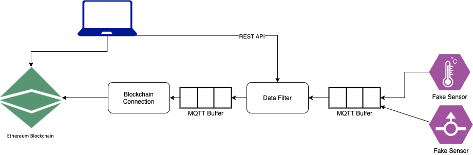
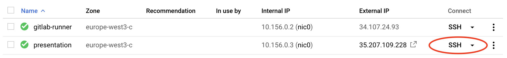

# Internet of Things for Smart Systems WS 2020 - Group 5 Topic B

Project Topic B – Blockchain-based Sensor Data Integration

## Team

Samir Duvelek (01426832)

David Kirchsteiger (01402259)

Luca Moroldo (12016307)

Konstantin Strümpf (01526204)

## Overview

This project simulates readings from multiple sensors (temperature, humidity, air pressure, wind speed, etc.) and stores
relevant values in a blockchain. A user can sett multiple filters in a dashboard in order to change what data is
relevant and stored permanently. This could for example be used by an insurance company for only permanently storing
data from days with extreme weather conditions in order to be able to understand later which services are to be
reimbursed.

## Architecture

In general the architecture follows
a [pipes and filters](https://docs.microsoft.com/en-us/azure/architecture/patterns/pipes-and-filters) pattern for
integrating the data from fake sensors into the blockchain. Filters can be set and updated via a REST API directly from
the frontend. Sensor measurements are transported as MQTT messages between the various components.

### Tech Stack

All components are provided as [Docker](https://www.docker.com/) images. For communication with the message broker
the [MQTT](https://mqtt.org/) protocol is used (message broker: [Eclipse Mosquitto](https://mosquitto.org/)). For
communication with the blockchain a web3 library is used in [js](https://web3js.readthedocs.io)
as part of a [Python](https://web3py.readthedocs.io) script. The fake sensors are implemented
in [Python](https://www.python.org/) using the [pandas](https://pandas.pydata.org/) library for reading thhe sensor
values from csv files. The filters are implemented with [Java](https://www.java.com/en/) using
the [Spring Boot](https://spring.io/projects/spring-boot) framework. The frontend uses [Angular](https://angular.io/) as
a framework.

## How to run

To run the project clone the repository to your local machine. An installation
of [docker-compose](https://docs.docker.com/compose/) is required to start the project.

For simplifying the local execution a Makefile (requires
the `make` [tool](https://en.wikipedia.org/wiki/Make_(software))) is provided that supports the following targets:

* `make start` builds and starts the project in the background (frontend can be accessed via http://localhost:8080)
* `make start-logs` builds and starts the project in the foreground (frontend can be accessed via http://localhost:8080)
* `make stop` stops the execution of the project
* `make purge` stops the project, removes all volumes and deletes the images

## How to run in the cloud

The project has also been deployed to a VM on the Google Cloud Platform and can be accessed
via [iotws20.allteams.at](http://iotws20.allteams.at/). This deployment publishes data to an Ethereum Testnet (see
dedicated chapter).

### For manual deployment

* Log into Google Cloud Console and navigate to the project IOTWS2020 Group
  5's [VM Instances](https://console.cloud.google.com/compute/instances?project=iotws2020-group-5-297717)
* Open a new shell on the `presentation` instance directly in the browser or via gcloud cli tool provided in the
  dropdown 
* Redeploy the project by executing `/srv/iot-presentation/deploy.sh`
* The frontend should be accessible from [iotws20.allteams.at](http://iotws20.allteams.at/)

## Testnet

As a testnet we decided for [Kovan](https://kovan-testnet.github.io/website/), since it has the least block time (
according to this [stackexchange-post](https://ethereum.stackexchange.com/a/30072)) and is supported
by [Infura](https://infura.io/). We use Infura to connect to Kovan via Infura without requiring to run a full node. We
use this [account](https://kovan.etherscan.io/address/0xdbd5927b822456c88b5e0a803ac08c26d2b6cb5e) to create the contract
and transact the data.

## Deploy the contract

Depending on the commandline arguments the blockchain-publisher project is configured to either use an existing contract
or deploy the contract by compiling its ´.sol´-file and make the contract-creation-transaction using the provided
blockchain account. For details see its [usage description](./blockchain-publisher/README.md).

## How to debug

You can run all docker containers locally with the environment file for development:

`docker-compose --env-file .env.dev up --build`

or run each sub project directly on your host by checking out the README files there.

## Contributions
- Luca Moroldo: data-filter
